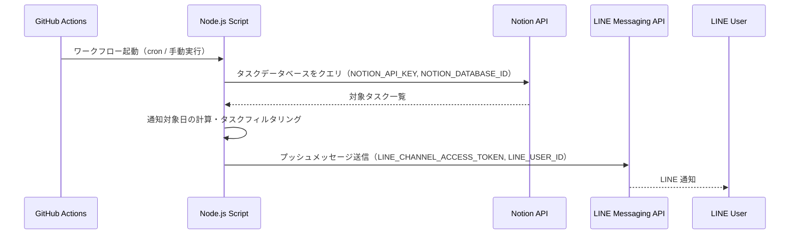
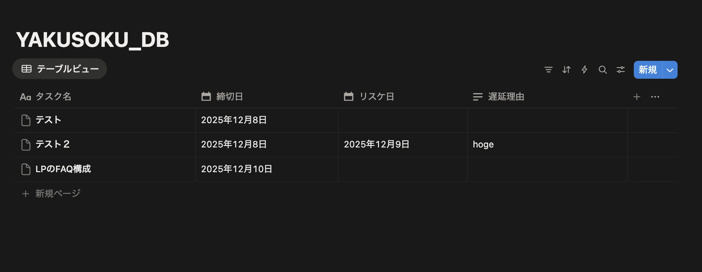

# yakusoku-public

Notion のタスク管理データベースから、締切日・リスケ日をもとにタスクを抽出し、GitHub Actions 上でのバッチ実行を通じて LINE にプッシュ通知するためのリポジトリだんな。

## 要件定義

本リポジトリの詳細な仕様・前提条件・データフローは、以下の要件定義書にまとめてある。

- [要件定義書: Notionタスク LINE通知システム](./prompt/requirement.md)

README では、主にセットアップ手順とトークン取得方法、全体のシーケンスを説明する。

## 全体構成

- GitHub Actions のスケジュール実行で TypeScript スクリプトを起動
- Notion API からタスクを取得
- 締切日/リスケ日から通知対象タスクを抽出
- LINE Messaging API で指定ユーザーにプッシュ通知

## シーケンス図（GitHub Actions ↔ Notion / LINE）



## 必要なもの

- Node.js v20 系
- GitHub アカウント
- Notion アカウント
- LINE アカウント（LINE Messaging API 用）

---

## 1. Notion 側の設定

### 1-1. タスクデータベースの作成

Notion でデータベース専用ページを作成して、カラムを以下の通り設定する。

- 「タスク名」（テキスト型 / タイトル）
- 「締切日」（日付型）
- 「リスケ日」（日付型）
- 任意: 「遅延理由」（テキスト型） - 直接 Notion へ入力するためマストではない



### 1-2. Notion Integration の作成と `NOTION_API_KEY` 取得手順

1. ブラウザで Notion にログインする。
2. [My integrations](https://www.notion.so/my-integrations) を開く。
3. 「+ New integration」から新しい Integration を作成。
   - 任意の名前（例: `yakusoku-notifier`）
   - ワークスペースを選択
   - 権限は *Read content* が含まれていることを確認
4. 作成後に表示される **Internal Integration Token** をコピーする。
5. これを `NOTION_API_KEY` として `.env` / GitHub Secrets に設定する。

### 1-3. データベースを Integration に共有する

1. 作成したタスクデータベースのページを開く。
2. 右上の「共有（Share）」ボタンをクリック。
3. 「Invite」から、さきほど作成した Integration を検索して追加し、少なくとも「Can read」権限を付与する。

### 1-4. `NOTION_DATABASE_ID` 取得手順

1. タスクデータベースのページをブラウザで開く。
2. 右上の「・・・」メニュー → 「Copy link」からページリンクをコピー。
3. クリップボードの URL を確認すると、次のような形式になっている。

   ```text
   https://www.notion.so/xxxxxxxxxxxxxxxxxxxxxxxxxxxxxxxx?v=yyyyyyyyyyyyyyyyyyyyyyyyyyyyyyyy
   ```

4. `xxxxxxxxxxxxxxxxxxxxxxxxxxxxxxxx` の 32 文字（ハイフンが入ることもある）がデータベース ID。
5. ハイフンが含まれている場合はそのまま使ってよい。これを `NOTION_DATABASE_ID` として `.env` / GitHub Secrets に設定する。

---

## 2. LINE Messaging API 側の設定

### 2-1. Messaging API チャネルの作成

1. [LINE Developers コンソール](https://developers.line.biz/console/) にログイン。
2. Provider（プロバイダ）を作成、または既存の Provider を選択。
3. 「チャネルを作成」→ 「Messaging API」 を選択。
4. チャネル名や業種などを入力し、利用規約に同意して作成する。

### 2-2. `LINE_CHANNEL_ACCESS_TOKEN` 取得手順

1. 作成した Messaging API チャネルの設定画面を開く。
2. 左メニュー「Messaging API」を選択。
3. 「チャネルアクセストークン（長期）」の項目から「発行」ボタンを押す。
4. 表示されたトークンをコピーし、これを `LINE_CHANNEL_ACCESS_TOKEN` として `.env` / GitHub Secrets に設定する。

### 2-3. `LINE_USER_ID` 取得手順（自分宛てに通知する場合）

1. 同じ Messaging API チャネルの「Messaging API」設定画面で、QR コードを表示し、自分の LINE から友だち追加する。
2. 友だち追加後、しばらくするとチャネルの「友だち」タブに自分のアカウントが表示される。
3. 「Your user ID」などの表記で表示されている ID をコピーする。
4. これを `LINE_USER_ID` として `.env` / GitHub Secrets に設定する。

（環境や UI のアップデートにより表示場所が変わる可能性があるため、見つからない場合は公式ドキュメントも参照してくれ。）

---

## 3. 環境変数の設定

このリポジトリには `.env.sample` が含まれている。以下の 4 つを設定する。

```text
NOTION_API_KEY=
NOTION_DATABASE_ID=
LINE_CHANNEL_ACCESS_TOKEN=
LINE_USER_ID=
```

### 3-1. ローカル開発用 `.env`

1. `.env.sample` をコピーして `.env` を作成。
2. 上記 4 つの値をそれぞれ貼り付ける。

### 3-2. GitHub Actions Secrets

GitHub リポジトリの設定で、同じ名前の Secrets を登録する。

1. GitHub のリポジトリページを開く。
2. 「Settings」→ 「Secrets and variables」→ 「Actions」へ進む。
3. 「New repository secret」から以下を追加。
   - `NOTION_API_KEY`
   - `NOTION_DATABASE_ID`
   - `LINE_CHANNEL_ACCESS_TOKEN`
   - `LINE_USER_ID`

これらは `.github/workflows/notify-tasks.yml` 内で参照され、GitHub Actions 上から Notion / LINE にアクセスするために使われる。

---

## 4. 実行方法

### 4-1. 依存パッケージのインストール

```bash
npm install
```

### 4-2. ビルド & ローカル実行

```bash
npm run build
npm start
```

### 4-3. GitHub Actions による定期実行

- `.github/workflows/notify-tasks.yml` に定義された cron に従って、毎日自動実行される。
- 手動実行を許可している場合は、GitHub Actions の画面から `Run workflow` でも動かせる。

---

## 5. 補足

- 詳細な仕様変更や拡張を行う場合は、まず [要件定義書](./prompt/requirement.md) を更新してから実装を変えると、「呪い」（技術的負債）を減らせるぞ。
- 不明点があれば、コードと要件定義を一緒に眺めながら読み解くといいんな。
